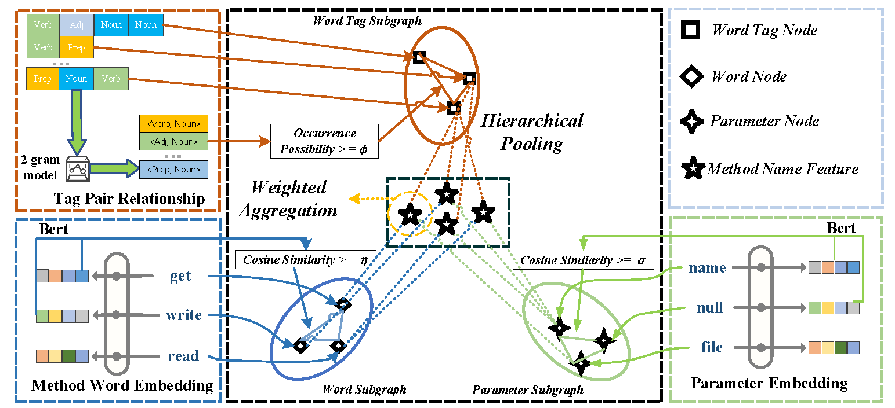

# NameSpotter
**NameSpotter** is designed to automatically identify low-quality method names with graph neural networks. It leverages three graph-based networks to extract features of method names: Word graph and word tag graph exploit the semantic and syntactic features of method names, and parameter graph exploit the semantic features of methods’ parameters. The overview of **NameSpotter** and the graph structure are plotted in the below two figures. 
<p align="center">
## Environment  
We implement NameSpotter with **PyTorch**, 
### Torch Version:
- Python 3.6.9
- Pytorch 1.2

and the other required packages can be found in **requirements.txt**.


## Quick Start
(1) Clone the repository from GitHub:
```
git clone https://github.com/AnonymousAccountSE/NameSpotter_OnlineRepos.git
```

(2) Configure the python and PyTorch environment and set up the environments by:
```
pip install -r requirements.txt
```

(3) Switch to the NameSpotter directory:
```
cd Code/NameSpotter
```
(4) Preprocess the data and get them prepared for training by:
```
cd preprocess
python proprocess.py
```
(5) Then, NameSpotter should work on our manually labelled dataset by:
```
cd PyTorch
python train.py
```
In addition, you can choose the specific GPU by:
```
python train.py --gpu 2
```

## Apply NameSpotter on Your Own Datasets

To apply NameSpotter on your own datasets, you need to make your data in the same form of "method_name_param_pos_tag.json".

NameSpotter can be evaluated on your own dataset by: 
``` 
cd preprocess
python One-Stop2Json.py
python proprocess.py
python train.py --dataset YOUR_DATA
```

## Tuning NameSpotter

The search space of all the hyperparameters can be found in search_space.txt. We follow the grid search strategy to perform the parameter tuning.


